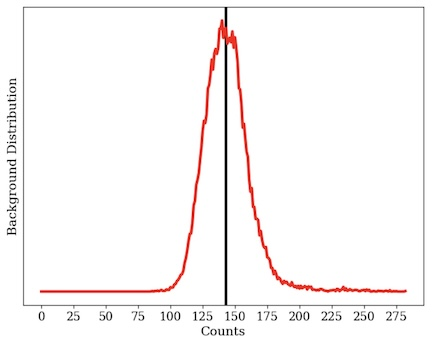
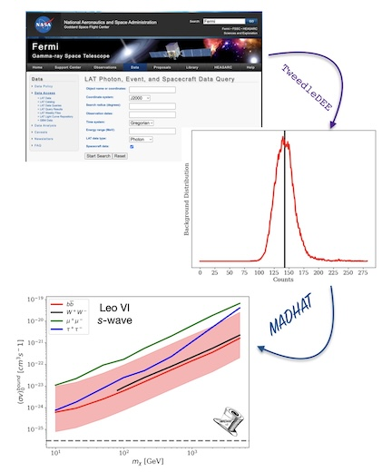

# TweedleDEE

**TweedleDEE is a Tool for Determining background Emission Empirically.**

TweedleDEE creates an empirical background model for the diffuse gamma-ray emission in a 1◦ region of the sky using publicly available gamma-ray data from the Fermi-LAT.  The background distribution is obtained in the form of a probability mass function (PMF), which is constructed using data off-axis from any user-specified region of interest (ROI).  This background model can be used to perform a purely data-driven search for anomalous localized sources of gamma-ray emission, including new physics.

TweedleDEE produces a background PMF file for the ROI as well as a file containing the photon data from the ROI itself, both readable by the [Model Agnostic Dark Halo Analysis Tool (MADHAT)](http://github.com/MADHATdm/MADHATv2).

# The TweedleDEE Wiki Contains:
- [Home](https://github.com/MADHATdm/TweedleDEE/wiki)
- [Installing TweedleDEE Dependencies](https://github.com/MADHATdm/TweedleDEE/wiki/Installing-TweedleDEE-Dependencies)
- [Initializing TweedleDEE](https://github.com/MADHATdm/TweedleDEE/wiki/Initializing-TweedleDEE)
- [Fermi-LAT Data Queries](https://github.com/MADHATdm/TweedleDEE/wiki/Fermi%E2%80%90LAT-Data-Queries)
- [Running TweedleDEE](https://github.com/MADHATdm/TweedleDEE/wiki/Running-TweedleDEE)
- [Output Formatting](https://github.com/MADHATdm/TweedleDEE/wiki/Output-Formatting)

If you use TweedleDEE please cite: 
[Hoskinson, Kumar & Sandick (2024)](https://arxiv.org/abs/2408.04611)

Note: This repo is under construction
